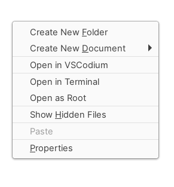

# `Open in VSCodium` option for Nemo



Nemo, the Cinnamon file manager, supports adding actions and scripts easily by adding a config file in `~/.local/share/nemo`.

So, for adding the `Open in VSCodium` option, you just need to place the file `vscodium.nemo_action` in the `actions` folder in the mentioned directory.

This repo has files for both VSCode and VSCodium. VSCodium is the FOSS binary for VSCode.

# Installation

## Open in VSCodium

```shell
sudo wget https://raw.githubusercontent.com/RobinBoers/nemo-open-in-vscodium/master/vscodium.nemo_action -O ~/.local/share/nemo/actions/vscodium.nemo_action
```

Or, clone this repository and run:

```shell
sudo cp nemo-open-in-vscodium/vscodium.nemo_action ~/.local/share/nemo/actions
```

## Open in VSCode (Original)

```shell
sudo wget https://raw.githubusercontent.com/RobinBoers/nemo-open-in-vscodium/master/vscode.nemo_action -O ~/.local/share/nemo/actions/vscode.nemo_action
```

Or, clone this repository and run:

```shell
sudo cp nemo-open-in-vscodium/vscode.nemo_action ~/.local/share/nemo/actions
```
